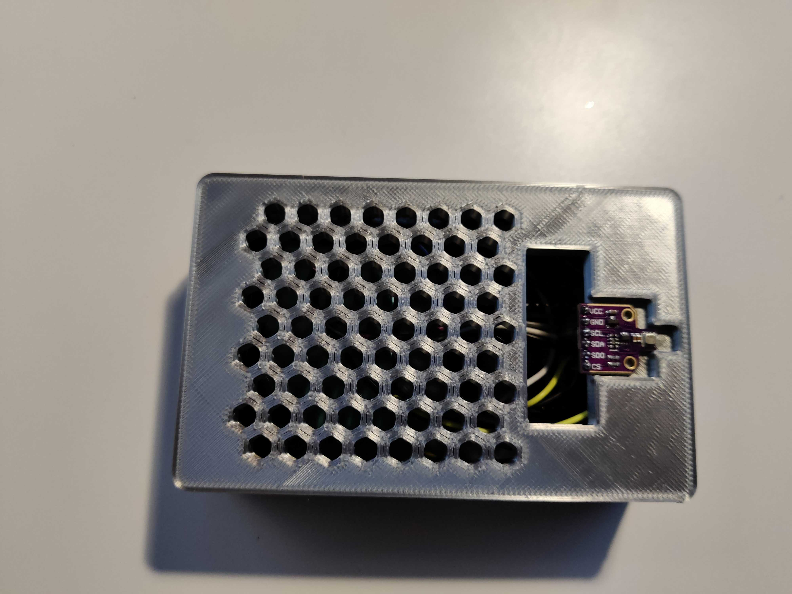

# Environment monitoring network

<p align="center">

</p>
<br/>

Budget friendly and low-power consumption environment monitoring system with:

- 2 x ESP32 boards
- 1 BME680 sensor
- 1 PM-G7/PMS7003
- 1 rain sensor
- 1 soil humidity sensor
- 1 Raspberry Pi Zero (or any other Rpi will do)
- 3 solar panel power supplies (optional)

For the purposes of this project, I simplified the readme to only include the major updates (3d files, new sensor configuration and raspberry pi zero configuration.). The other relevant information is in the repo ["Environment monitoring system with simple web server"](https://github.com/AN63L/environment_monitoring)

I added another configuration for a [simple rain sensor](https://soldered.com/product/simple-rain-sensor/) and a [simple soil humidity sensor](https://soldered.com/product/simple-soil-humidity-sensor/).

Because there are only 2 power pins (3V and 5V) on the ESP32 I use and didn't want to purchase an extension board, I simply created a second configuration for the sensors. If you purchase an extension board, you should be able to simply add the two new sensors to your existing configuration.

The additional costs for the rain and soil sensors are:

- EUR 6.85 for the [simple soil humidity sensor](https://soldered.com/product/simple-soil-humidity-sensor/)
- EUR 6.85 for the [simple rain sensor](https://soldered.com/product/simple-rain-sensor/)

The cost of this project is EUR 80 for the first sensor, about EUR 40 if you follow the rain sensor and humidity sensor and about EUR 25 for the raspberry Pi Zero, SD card and power cable. The total of this project comes down to round EUR 145. You will have to add an additional EUR 39 for the solar panels. Depending on how you source your products, you'll probably be able to take that amount down. 

## Overview

This project is an extension of the ["Environment monitoring system with simple web server"](https://github.com/AN63L/environment_monitoring) project I developed earlier. I improved it to include an additional ESP32 to measure rain and soil humidity, as well as a Raspberry Pi Zero to act as a remote server to gather all the data and send the relevant notifications.

Each ESP32 also exposes a web page on the local network with the values it calculates.

It includes the environment monitoring system (ESP32 + BME680 + PMS7003):
</br>


As well as the same system but with the rain and soil sensors:
</br>

</br>

</br>

And finally a raspberry Pi zero to act as the data gatherer and server:
</br>


The project structure is as follows:

- "ESP32 BME680 and PMS7003": platformio project for the first sensor system (bme680 amd pms)
- "ESP32 Soil and rain sensors": platformio project for the second sensor system (rain and soil)
- "Rpi Zero": code for the raspberry Pi Zero

## 3D prints

The parts were printed using a Creality CR-20 pro.

The pieces are as follows:

- soil_rain_case
- soil_rain_lid

My slicer settings were as follows:

- Infill: 10%
- Infill pattern: Gyroid
- Support: Touching build plate
- Support pattern: lines
- Nozzle size: 0.4mm
- Nozzle temp: 210 degrees
- Bed temp: 60 degrees
- Print speed: 80 mm/s
- Infill speed" 40 mm/s
- Travel speed 200 mm/s
- Initial layer speed: 20 mm/s
- Support: everywhere at 80 degrees angle

Case print time: 7h8m (71g)
Lid print time: 2h17m (25g)

Total print time: 9h25m (96g)

I also printed a new raspberry Pi Zero case as the one I had included too many holes for my taste (particularly for the GPIO pins) and I was looking for a design that would limit issues with humidity and water. The [design I used](https://www.thingiverse.com/thing:4582572) is from sharkymoto, thanks for the amazing case ! Print time is about 1h28m (15g) (same settings as above, with infill at 60% - necessary for the pins holding the board to be solid enough).

## ESP32 setup

### ESP32 Assembly and wiring

Esp32 pinout for reference:

<p align="center">

</p>

1. First, solder the pins to the rain and soil sensors

2. Next we wire the rain sensor to the ESP32

VCC -> 3V3 <br/>
GND -> GND <br/>
A0 -> 34 <br/>
D0 -> 4 <br/>

3. Next we wire the soil sensor to the ESP32

VCC -> VIN <br/>
GND -> GND <br/>
A0 -> 35 <br/>
D0 -> 32 <br/>

Here are some images for reference:


1. Place the magnets inside their dedicated holes on the lid and case. Make sure you keep an eye on the polarity, removing the magnets is not practical ! Placing the magnets is a little tricky, the holes are voluntarily tight, you will have to apply some pressure.

2. Glue de rain sensor to the side of the case


1. Glue the soil sensor to the bottom of the case. The width isn't perfect, you'll need to widen it a little bit by cutting it.


1. Place the components inside

2. close the lid and you're ready to go !
3. Install the Raspberry Pi inside the case once you've flashed the OS


__To avoid exposure to the elements, I added some plastic wrap around the power cables to cover the holes of the ESP32 sensor cases__

## Software setup and explanation - ESP32

I'm assuming you are familiar with the ESP32 micro-controller and know how to access and run it. There are loads of guides to get started, you can use these for reference:

- https://randomnerdtutorials.com/getting-started-with-esp32/
- https://www.youtube.com/watch?v=tc3Qnf79Ny8

- Setup a new project using PlatformIO (all the libraries are already included)
  I've included comments inside the code for additional explanations. You can un-comment certain lines to enable console logging.

The code does the following on a loop:

- Create the sensors
- Create the ESP32 onboard led
- Create the Wifi and server configuration
- Initialise the sensors
- Initialise the ESP32 onboard led
- Initialise the server
- Turn the LED on
- Get the readings from the rain sensor
- Get the readings from the soil sensor
- Update the webpage with the new readings
- Wait 10 seconds

The `setup()` function initialises the sensors and pin for the LED.

The `loop()` function handles the led on/off sensor readings.

The `processor()` function handles the update of the variables inside the index_html variable.

The `notFound()` function simply sends a 404 response if the page is not found.

The `sendToApi()` function takes the json created with the new data and sends it as a POST request to the relevant path. Once it has been sent, it empties de json. It will check if it is connected to the WiFi and if not blink the onboard led rapidly. We do not handle errors with this function beside the WiFi check as the ESP32 is not responsible for handling this error. The dashboard will display the last sensor data acquisition as well as an API connection error. This specific issue will be handled by notifications. 

_Data is retrieved approximately every minute. You can request fewer data by increasing the delay in the code_

### Web page usage

To connect to the web page of each individual ESP32, simply visit inside a web browser the IP of the ESP32 (displayed inside the serial console or via your router admin panel).

## Software setup and explanation - Raspberry Pi Zero

The raspberry Pi will server as:

- an API to receive the data from the ESP32s
- a database to store the metrics received from the ESP32s
- A web server to display the results
- A notification system to send notifications when an action is required
- A system to handle the update of database materialised views

Remote access will be done using Tailscale.

I'm assuming you are familiar with the Raspberry Pi Zero and know how to set it up.

- Flash Debian Bullseye Legacy OS using Raspberry Pi Imager.
- Connect to the raspberry pi using your preferred method (SSH)
- move to sudo `sudo su`
- SFTP transfer the folders inside RPI Zero to the sudo user root directory (something like `/home/<username/`)

**I setup the Rpi with the hostname _monitor_, any reference to it or _monitor.local_ local url should be replaced with ther hostname you setup.**

### Database (PostgreSQL)

_Sensor 1 is the BME680+PMS7003 sensor system and system 2 is the rain+soil sensor system._

1. Install Postgres: `sudo apt-get install postgresql postgresql-contrib`
2. Enable remote access to the DB
   1. `sudo nano <path to your pg_hba.conf file>` (i.e. `sudo nano /etc/postgresql/13/main/pg_hba.conf`)
   2. Use the arrow keys to move down the file until you start seeing uncommented (white) text. If you want to be able to connect from any machine on your home network add an entry under IPv4 local connections with your network address and the CIDR notation of your subnet mask. Most likely something like: `host     all     all     192.168.1.0/24     trust`
   3. Now you will need to edit the postgresql.conf file. This is most likely in the same directory where you found the pg_hba.conf file. That is, if your hba.conf file was at /etc/postgresql/13/main/pg_hba.conf your postgresql.conf file should be there. Now execute: `sudo nano /etc/postgresql/13/main/postgresql.conf`
   4. You will want to uncomment (delete the # sign) in front of the listen_adress and change the ‘localhost’ to ‘\*’. This means if your Raspberry Pi gets a different address you can still connect to it. If you have your IP Reservation in place you can change this to be the IP of your Raspberry Pi.
   5. Close the file and restart Postgres : `sudo /etc/init.d/postgresql restart`
   6. You can now access your db from PGAdmin on your local network
3. Create a new user to access postgres and deactivate postgres. My user will be called `pgmonitor` but you can call it whatever you want:
   1. `sudo su postgres`
   2. `createuser pgmonitor -P interactive` (and follow the instructions, I recommend you make it a super user for simplicity but beware that proper security practices recommend that you: create a separate super user from the user access the db from your API)
   3. Deactivate login access for the default user postgres. Inside PGAdmin, run `ALTER ROLE postgres NOLOGIN;`
4. Finally, we will create material views using PGAdmin. The Dashboard (_see front-end section_) can display aggregated values filtered by week, month, etc. To avoid requesting the same value each time the page is refreshed and to save reduce the latency of the request, we will use materialised views. The code for each table is available in `RPI Zero>sql>materialised_views.sql`. Each table is refreshed *every hour* (you can change the refresh period, please see `Adding materialized view refresh` section). 
5. And you are done !

_You can find sample data to populate the tables for testing in the `sql>samples` folder._

### API

We setup the API using [FastAPI](https://fastapi.tiangolo.com/). The objective of the API is extremely simple: receive data through a post request from each sensor and populate the table accordingly. It uses SqlAlchemy as an ORM and Pydantic to parse the data.

1. Install FastAPI : `sudo pip install fastapi`
2. Install uvicorn : `sudo pip install "uvicorn[standard]"`
3. Copy the contents from the `Rpi Zero>api` folder in your home directory
4. Install SQLAlchemy: `sudo pip install sqlalchemy`. We use SQLAlchemy as an ORM to facilitate access to the DB.
5. Install psycopg2 : `sudo pip install psycopg2`
6. Install pytz : `sudo pip install pytz`
7. Install Datetime : `sudo pip install Datetime`

The live documentation of the API is available here (assuming you've copied and launched the API): http://monitor.local:8000/docs. Sample requests are also available in the documentation.

The API allows requests for the following: 
- return the version and health of the page
- Receive sensor 1 data
- Receive sensor 2 data
- Return the sensor 1 data, with 100 maximum entries for the tables page
- Return the sensor 2 data, with 100 maximum entries for the tables page
- get the notification preferences
- update the notification preferences
- return chart data
- return dashboard data

#### API Logging

The `log.ini` file contains the log configuration for the API. If you follow this guide, particularly the section on automatic launch, which contains the part on log setup, you will see logs in the `logs` folder. 

#### Running the API

Go inside the `api` folder. 

To run the API: `sudo uvicorn main:app --reload --host 0.0.0.0` (by default it will run on port 80).

FYI for those running this on powershell for testing (like me), you can run the following command _inside the `api` folder_: `sudo python -m uvicorn main:app --reload --host 0.0.0.0`.

_By default the api will run on port 8000_

#### Killing Uvicorn

_Replace `8000` with the port you are using_

`lsof -i :8000`
</br>
`kill -9 <PID>`

#### Testing

You can test the API locally using an API management system, like [Postman](https://www.postman.com/).

### Web server

The objective is to have a simple web server served in HTTPs, which we will access remotely via Tailscale.

The server runs with Apache2 with a reverse proxy and self-signed certificated for the SSL. The front-end library is Vue.js. The template used is Mosaic from [Cruip](https://cruip.com).

There are simpler ways to do this, with dedicated databases for time series and tools like grafana for creating graphs. However, I wanted to build this dashboard from scratch with full flexibility over the contents. 

The web server includes four pages: 
- A Dashboard: It displays the latest values received, the last time sensor data was received and also calculates Air Quality. 
- A Graphs page: It displays graphs (filterable by today, last 7 days, last 30 days, last year and all time) of all the main sensor metrics.
- A Tables page: It displays the last 100 items for both the sensor_1 and sensor_2 table.
- A Notifications page: This page handles which notifications are enabled or not.

__CAUTION: There is no authentication setup to login to dashboard. It only runs on my local network with access through Tailscale, however you might want to add the additional layer of security.__

#### Running the web app
- install the packages with `yarn` or `npm install`
- run with `yarn serve` or `npm run serve`

#### Setting up the Webserver

We will use Apache for web server. Access to the dashboard will be available locally and through tailscale.

To setup the webserver on the pi:
- ssh into the pi
- Copy the contents from the `Rpi Zero>front-end` folder in your home directory- in the root directory
- If haven't done so, install node. You can install node on the Rpi Zero by running (__Beware: RPI zero arm architecture is different to the compatible arm architectures of latest versions of node's official release__):
  - `wget https://unofficial-builds.nodejs.org/download/release/v21.0.0/node-v21.0.0-linux-armv6l.tar.xz`
  - `tar xvfJ node-v21.0.0-linux-armv6l.tar.xz `
  - `sudo cp -R node-v21.0.0-linux-armv6l/* /usr/local`
  - `rm -rf node-*`
  - `sudo reboot`
  - `sudo nano ~/.profile`
  - Add the line `PATH=$PATH:/usr/local/bin`
  - `sudo reboot`
  - Check that node and npm are installed with `node -v && npm -v`
  - optionally install yarn `npm install --global yarn`
- go to the `front-end` folder and install the packages with `yarn` or `npm install`
- Inside the front-end directory run `yarn build` or `npm run build` to build the files. Depending on the rpi you are using, you may get an `Illegal instruction` error. To fix this, build the files on your local machine and then transfer the `dist` folder over SFTP to the rpi.
- Setup the apache2 server by:
  - installing apache with `sudo apt install apache2 -y`
  - copy the files from the front-end dist folder to the `/var/www/html` folder with `sudo cp -R /home/<username>/front-end/dist/* /var/www/html/`
- Your dashboard should be available at the rpi's IP address, if you followed this guide go to `http://monitor.local`. You will not be able to access the API via chrome (Firefox will work) as Chrome prevents access to the API without SSL. Please follow the guide below to setup SSL. 
- Finally, we will need to setup the reload in place. Without this, if you are not on the dashboard page and reload, you will receive a 404 error. To do this: 
- add the following to /etc/apache2/apache2.conf
```
<Directory /var/www/html/>
        RewriteEngine On
        RewriteBase /
        RewriteRule ^index\.html$ - [L]
        RewriteCond %{REQUEST_FILENAME} !-f
        RewriteCond %{REQUEST_FILENAME} !-d
        RewriteRule . /index.html [L]
</Directory>
```
- run `sudo a2enmod rewrite`
- run `sudo systemctl restart apache2.service`

#### (optional) setting up SSL for the webserver and API

Set up SSL with self-signed certificates by:
- go to your home directory
- create the certificates with `sudo openssl req -x509 -nodes -days 365 -newkey rsa:2048 -keyout private.key -out certificate.crt`. Fill in the required info. 
- move the files to your private ssl folder `sudo mv private.key /etc/ssl/private/ && sudo mv certificate.crt /etc/ssl/certs/`
- Configure Apache to use Self Signed Certificate and Key `sudo nano /etc/apache2/sites-available/000-default.conf`
- Add the following new virtual host:
```
<VirtualHost *:443>
      ServerAdmin webmaster@localhost
      DocumentRoot /var/www/html
      ErrorLog ${APACHE_LOG_DIR}/error.log
      CustomLog ${APACHE_LOG_DIR}/access.log combined
      SSLEngine on
      SSLProtocol all -SSLv2
      SSLCipherSuite HIGH:MEDIUM:!aNULL:!MD5
      SSLCertificateFile "/etc/ssl/certs/certificate.crt"
      SSLCertificateKeyFile "/etc/ssl/private/private.key"
</VirtualHost>
```
- Enable SSL (you can skip “Could not reliably determine the server’s fully qualified domain name” warnings):
```
sudo a2enmod ssl
sudo apache2ctl configtest
sudo systemctl restart apache2.service
```
- Redirect http to https by:
  - editing the default apache config `sudo nano /etc/apache2/sites-available/000-default.conf`
  - Change first virtual block (answering to port 80) by adding following row (replace `monitor.local` with whatever your hostname is):
```
<VirtualHost *:80>
        . . .
        Redirect "/" "https://monitor.local/"
        . . .
</VirtualHost>
```
  - close and save then restart apache2 service with `sudo systemctl restart apache2.service`

Generate a self-signed certificate for the api:
- Go to your home directory
- `openssl req -x509 -newkey rsa:4096 -nodes -out cert_api.pem -keyout key_api.pem -days 365`
- move the files to your private ssl folder `sudo mv key_api.pem /etc/ssl/private/ && sudo mv cert_api.pem /etc/ssl/certs/`
- `sudo uvicorn --host 0.0.0.0 main:app --log-config ./resources/log.ini --reload --ssl-keyfile /etc/ssl/private/key_api.pem --ssl-certfile /etc/ssl/certs/cert_api.pem`
- don't forget to replace the `http` with `https` and rebuild/replace the front-end if necessary.

**We keep the http port available so the sensors can post the data**.


**In production, I highly recommend you use certbot rather than self-signed certificates. Beware that opening your local ports to the public internet is risky**.


### Notifications (via email)

The notifications front-end page allows the user to enable or disabled notifications. It handles updates to the notifications table in postgres

As of this version, you can setup notifications for:
- no sensor 1 data acquired in the last 10 minutes: checked using a cron function that is executed every 10 minutes (technically, according to cron rules every time the minutes are divisible by 10) - max once a day
- no sensor 2 data acquired in the last 10 minutes: checked using a cron function that is executed every 10 minutes (technically, according to cron rules every time the minutes are divisible by 10) - max once a day
- the soil is very dry: checked using a cron function that is executed every day at 8 am - max once a day
- the soil is very wet: checked using a cron function that is executed every day at 8 am - max once a day
- it has started raining: checked using a cron function that is executed every hour - if the last notification was that it was raining, do nothing
- it has stopped raining: checked using a cron function that is executed every hour - if the last notification was that it stopped raining, do nothing

We check when was the last notification sent and limit the rate of notifications by type. 
The notification events are logged inside the `notification_logs` table. It is created when the API is setup, you won't have to create it manually. 

Cron will run a python script with an argument for the notification frequency. These scripts will: 
- Check the `notifications` table for each type of notification to see if it is enabled or not
- Query SQL to check the conditions for each notification
- If it receives a value that is valid for that specific rule, it will:
  - check the rule for the last time it was sent and if applicable:
    - send an email 
    - log the event in `notifications_log`
  - Otherwise it will ignore it

- Update the .env file - I recommend you use a new email address to send emails. You can use a service like mailgun. _If you use mailgun, don't forget to add the destination email to the sandbox emails. Mailgun free accounts are only for sandboxing_
- To add these rules run `sudo crontab -e`
- add the following lines
  - `*/10 * * * * python3 /home/<username>/notifications/check_notifications_to_send.py 'sensor_1_last_update_over_10'`
  - `*/10 * * * * python3 /home/<username>/notifications/check_notifications_to_send.py 'sensor_2_last_update_over_10'`
  - `0 8 * * * /home/<username>/notifications/python3 check_notifications_to_send.py 'soil_very_dry'`
  - `0 8 * * * /home/<username>/notifications/python3 check_notifications_to_send.py 'soil_very_moist'`
  - `0 */1 * * * python3 /home/<username>/notifications/check_notifications_to_send.py 'started_raining'`
  - `0 */1 * * * python3 /home/<username>/notifications/check_notifications_to_send.py 'stopped_raining'`
- run `sudo reboot` to test if it works

_The logs for the execution of the script are located in `RPI Zero>notifications>logs`._

### Adding materialized view refresh

We use a bash script to refresh the materialized views every hour. This script is invoked every hour via a cron command that we setup as follows. 

The script executed is called `update_views.sh` this script simply logs into psql and invoked the `refresh_views.sql` file. The results of the execution are logged in the file `Rpi Zero>sql>log.txt`

- You will need to enable local pg user access (the one you created before) to execute this script.
- rename the file `sql/update_views.sh.example` to `sql/update_views.sh`
- replace the placeholder values with your values. If you've followed this guide, you will only need to update the username
- create a log.txt file inside the sql folder `sudo touch sql/log.txt` (don't forget to save on exit)
- Run `sudo su` for admin privileges
- run `sudo crontab -e` (if it is your first time running it, you will have to select an editor first - I recommend nano for beginners). I recommend you use sudo here to avoid user access right issues when booting up the Pi. Although from a security standpoint it is not a good practice, also make sure that you auto-login (sudo raspi-config) when booting up the Pi.
- add the following line `0 */1 * * * bash /home/<username>/sql/update_views.sh`, making sure you replace your username and have the & at the end of the line. If you've changed the filenames and folder structure, make sure it is correct here as well. 
- check the `Rpi Zero>sql>log.txt` file to test if it works

### Setup run at boot (database, api, web server)

If you've followed this guide, the PostgreSQL database will start at boot. We will here add the lines to the cron file to start the API and web server with the dashboard at boot. If you've followed this guide, you should have already set up the notifications handling and materialised views for regular updates. 

- run `sudo systemctl enable apache2` to start apache2 at boot.
- run `sudo crontab -e` (if it is your first time running it, you will have to select an editor first - I recommend nano for beginners). I recommend you use sudo here to avoid user access right issues when booting up the Pi. Although from a security standpoint it is not a good practice, also make sure that you auto-login (sudo raspi-config) when booting up the Pi.
- add the following line `@reboot cd /home/<username>/api && uvicorn --host 0.0.0.0 main:app --log-config ./resources/log.ini --reload --ssl-keyfile /etc/ssl/private/key_api.pem --ssl-certfile /etc/ssl/certs/cert_api.pem &`, making sure you replace your username and have the & at the end of the line. If you've changed the filenames and folder structure, make sure it is correct here as well. 
- add the following line at the end of your reboot line `cd /home/<username>/api && uvicorn --host 0.0.0.0 --port 3000 main:app --log-config ./resources/log_http.ini &` , making sure you replace your username and have the & at the end of the line. If you've changed the filenames and folder structure, make sure it is correct here as well. This is the http part for the sensors with do not post in HTTPS and post to the port 3000. We don't log those requests.
- run `sudo reboot` to test if it works

Your final cron file should look something like this: 
```
@reboot cd /home/<username>/api && sudo uvicorn --host 0.0.0.0 main:app --log-config ./resources/log.ini --reload --ssl-keyfile /etc/ssl/private/key_api.pem --ssl-certfile /etc/ssl/certs/cert_api.pem &
@reboot cd /home/<username>/api && sudo uvicorn --host 0.0.0.0 --port 3000 main:app --log-config ./resources/log_http.ini --reload &
0 */1 * * * bash /home/<username>/sql/update_views.sh
*/10 * * * * python3 /home/<username>/notifications/check_notifications_to_send.py 'sensor_1_last_update_over_10'
*/10 * * * * python3 /home/<username>/notifications/check_notifications_to_send.py 'sensor_2_last_update_over_10'
0 8 * * * /home/<username>/notifications/python3 check_notifications_to_send.py 'soil_very_dry'
0 8 * * * /home/<username>/notifications/python3 check_notifications_to_send.py 'soil_very_moist'
0 */1 * * * python3 /home/<username>/notifications/check_notifications_to_send.py 'started_raining'
0 */1 * * * python3 /home/<username>/notifications/check_notifications_to_send.py 'stopped_raining'
```

__NOTE: the setup of the APIs takes a while, especially on an Rpi Zero. Expect to wait a few minutes (~4 minutes) before the APIs are available__

### Tailscale

To access the Raspberry Pi remotely we are going to use [Tailscale](https://tailscale.com/). I have tested different types of VPN over the years from Wireguard, OpenVPN, ZeroTier and others and I have found that Tailscale is the most practical solution. It doesn't require a complicated install and manages everything for you.

We do this to avoid exposing the Raspberry Pi to the internet and having to setup SSL on the webserver (no really required if you are only accessing it via a VPN, essential on your local network).

Using Tailscale is very easy:

- Create a Tailscale account at https://tailscale.com/
- Once you've create an account, go the the "Machines" page and click "Add device"
- Select linux and copy and paste the command line provided
- Don't forget this step: enter `sudo tailscale up` in the terminal of the Raspberry Pi to activate it
- Follow the link provided and login
- Click connect
- Do the same for the client (i.e the device you are going to use to access the Raspberry Pi)
- To prevent key expiry and having to re-login every 90 days, go to the tailscale admin panel and for your new machine click on `settings > disable key expiration`.
- Replace the front-end .env API path with the tailscale IP address of your machine, rebuild, replace and restart apache2 service. `sudo cp -R /home/<usename>/front-end/dist/* /var/www/html/ && sudo systemctl restart apache2.service`


### IP handling

Your router may not be good at resolving `.local` address, to avoid this I've used hard-coded IPs. This may be an issue when your router reboots, to avoid this access the router's admin console and assign a static IP to each device (You can usually do this by visiting the `192.168.1.1` address from any browser).

### Logging

You will notice that each RPI folder contains a method or process for logging. You can find information in each relevant section and some folders contain a `logs` folder to store the logs.

For debugging purposes, I also recommend you enable cron logs by:
- running `sudo nano /etc/rsyslog.conf`
- uncommenting the line `# cron.*                          /var/log/cron.log`
- restarting rsyslog `/etc/init.d/rsyslog restart`

## Future improvements & current limitations

The main limitation is that these sensors currently need access to WiFi. This isn't ideal if you are setting up more than two sensors and over large spaces. A possible solution would be to use the individual network capabilities of each ESP32 to ultimately send it back to the nearest ESP32 with access to the WiFi.

The modularity of the API, database and front-end could be improved, particularly when it comes to adding new sensors or notification types (today this would require new tables, new paths and setting up new charts manually). 

### Hardware
- Improve the placeholders for the sensors:
  - The depth of the rain sensor should be increased
  - the width of the soil sensor should be increased
- Improve handling of power cable to avoid humidity intrusion

### Front-end
- Go even further with the components to avoid repetitive code (buttons)
- Improve chart design
- Convert all charts to Apex charts

### Back-end
- Create a bash script for faster setup
- Create a host network with Rpi to the ESP32s will connect. This will ensure that the ESP32s can be placed at a further distance without requiring access to the same local network as the Rpi.
- The parsing of the data from the database for the views should be optimised
- Add a VPN to access the ESP32s remotely, particularly useful for remote debugging
- There is an unknown error when inserting data into notifications_log tab for the notifications script. It needs to be investigated.
- Setup rules to save storage by deleting old entries in the database and cleaning logs are regular intervals
- Integrate https calls for the sensors

## Useful guides

- [Postgres on RPI](https://dataslinger.medium.com/setting-up-remote-postgresql-on-raspberry-pi-f9058b415768)
- [SQLAlchemy+PSQL+FastAPI](https://fastapi.tiangolo.com/tutorial/sql-databases/#review-all-the-files)
- [environment handling with platformio](https://stackoverflow.com/questions/62314497/access-of-outer-environment-variable-in-platformio)
- [installing node on Rpi Zero](https://hassancorrigan.com/blog/install-nodejs-on-a-raspberry-pi-zero/)
- [Apache2 self-signed SSL](https://peppe8o.com/self-signed-certificate-https-in-raspberry-pi-with-apache/)
- [FastAPI self-signed SSL](https://medium.com/@mariovanrooij/adding-https-to-fastapi-ad5e0f9e084e)